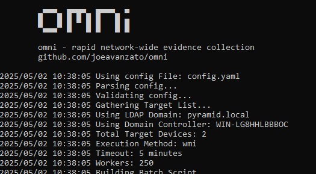
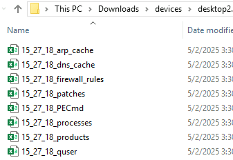

<p align="center">
  
</p>

### What is it?

- An open-source, modular, extensible utility for collecting evidence via commands, scripts and files from remote Windows devices to enhance the efficiency of Incident Responders

omni helps incident responders rapidly aggregate information from domain-joined devices across an enterprise network.

The main focus is on collecting light-weight datasets as quickly as possible to help responders identify anomalies and quickly hunt known-bad indicators across a network - but technically it is possible to execute and collect any type of evidence using any type of host-based tooling.

It is easy to collect new data by modifying config.yaml on the fly to run scripts, commands or tools on remote devices.

It works by dynamically building a batch file that is deployed to targets along with any specified files and directories - this batch file controls execution and is remotely executed via schtasks by default - output files are then retrieved via SMB and deployed artifacts are cleaned-up from each target.

omni can receive a list of targets at the command-line, via a line-delimited file or can dynamically query Active Directory for all enabled computer accounts to use as response targets.


<p align="center">
  
</p>

### Example Usage
```
omni.exe
- Will launch omni with all targets from config.yaml and default timeout/worker settings using WMI and will query AD for targets

omni.exe -workers 500 -timeout 30 -tags quick,process
- Add more workers, increase the timeout duration per-target and only use configurations with the specified tags

omni.exe -targets hostname1,hostname2,hostname3
omni.exe -targets targets.txt
- Use the specified computer targets

omni.exe -method task
- Deploy omni using Scheduled Tasks instead of WMI for remote execution

```

### Configuration File
The configuration file controls omni's behavior - it is a YAML file that specifies commands to run, files/directories to copy, tools to prepare/download, etc.

config.yaml can specify individual commands to execute - each of which are loaded into a batch file and prefixed with cmd.exe /c - for example:
```
command: powershell.exe -Command "Get-WmiObject -Class Win32_StartupCommand -Locale MS_409 -ErrorAction SilentlyContinue | Select PSComputerName,Caption,Command,Description,Location,Name,User,UserSID | Export-Csv -Path '$FILENAME$' -NoTypeInformation"
file_name: $time$_wmi_startups.csv
merge: csv
id: wmi_startups
tags: [quick, persistence]
```

We can also specify files - locally or remotely, that are to be copied to the target device for further use - such as copying a complex PowerShell script to execute:

```
command: file=https://raw.githubusercontent.com/joeavanzato/trawler/master/trawler.ps1 | powershell.exe -Command "Add-MpPreference -ExclusionPath "C:\Windows\Temp\trawler.ps1" -Force" & powershell.exe C:\Windows\temp\trawler.ps1 -csvfilename '$FILENAME$' -OutputLocation 'C:\Windows\temp' -ScanOptions ActiveSetup,AMSIProviders,AppCertDLLs,AppInitDLLs,ApplicationShims,AppPaths,AssociationHijack,AutoDialDLL,BIDDll,BITS,BootVerificationProgram,COMHijacks,CommandAutoRunProcessors,Connections,ContextMenu,ChromiumExtensions,DebuggerHijacks,DNSServerLevelPluginDLL,DisableLowIL,DirectoryServicesRestoreMode,DiskCleanupHandlers,ErrorHandlerCMD,ExplorerHelperUtilities,FolderOpen,GPOExtensions,GPOScripts,HTMLHelpDLL,IFEO,InstalledSoftware,InternetSettingsLUIDll,KnownManagedDebuggers,LNK,LSA,MicrosoftTelemetryCommands,ModifiedWindowsAccessibilityFeature,MSDTCDll,Narrator,NaturalLanguageDevelopmentDLLs,NetSHDLLs,NotepadPPPlugins,OfficeAI,OfficeGlobalDotName,Officetest,OfficeTrustedLocations,OfficeTrustedDocuments,OutlookStartup,PATHHijacks,PeerDistExtensionDll,PolicyManager,PowerShellProfiles,PrintMonitorDLLs,PrintProcessorDLLs,RATS,RDPShadowConsent,RDPStartupPrograms,RemoteUACSetting,ScheduledTasks,ScreenSaverEXE,ServiceControlManagerSD,SEMgrWallet,ServiceHijacks,Services,SethcHijack,SilentProcessExitMonitoring,Startups,SuspiciousFileLocation,TerminalProfiles,TerminalServicesDLL,TerminalServicesInitialProgram,TimeProviderDLLs,TrustProviderDLL,UninstallStrings,UserInitMPRScripts,Users,UtilmanHijack,WellKnownCOM,WERRuntimeExceptionHandlers,WindowsLoadKey,WindowsUnsignedFiles,WindowsUpdateTestDlls,WinlogonHelperDLLs,WMIConsumers,Wow64LayerAbuse,WSL & powershell.exe -Command "Remove-MpPreference -ExclusionPath "C:\Windows\Temp\trawler.ps1" -Force"
file_name: $time$_trawler.csv
merge: csv
id: trawler
```

This configuration tells omni attempt to download the specified file using the base name (trawler.ps1) and then add the remainder (after the first |) to the batch file as a normal command - just make sure the binary/script allows for exporting to custom filenames - otherwise pipe the output.

We also could have it specify a local file to copy if we don't want to invoke http requests to download something on our main device / can't download anything.

```
command: file=trawler.ps1 | powershell.exe -Command "Add-MpPreference -ExclusionPath "C:\Windows\Temp\trawler.ps1" -Force" & powershell.exe C:\Windows\temp\trawler.ps1 -csvfilename '$FILENAME$' -OutputLocation 'C:\Windows\temp' -ScanOptions ActiveSetup,AMSIProviders,AppCertDLLs,AppInitDLLs,ApplicationShims,AppPaths,AssociationHijack,AutoDialDLL,BIDDll,BITS,BootVerificationProgram,COMHijacks,CommandAutoRunProcessors,Connections,ContextMenu,ChromiumExtensions,DebuggerHijacks,DNSServerLevelPluginDLL,DisableLowIL,DirectoryServicesRestoreMode,DiskCleanupHandlers,ErrorHandlerCMD,ExplorerHelperUtilities,FolderOpen,GPOExtensions,GPOScripts,HTMLHelpDLL,IFEO,InstalledSoftware,InternetSettingsLUIDll,KnownManagedDebuggers,LNK,LSA,MicrosoftTelemetryCommands,ModifiedWindowsAccessibilityFeature,MSDTCDll,Narrator,NaturalLanguageDevelopmentDLLs,NetSHDLLs,NotepadPPPlugins,OfficeAI,OfficeGlobalDotName,Officetest,OfficeTrustedLocations,OfficeTrustedDocuments,OutlookStartup,PATHHijacks,PeerDistExtensionDll,PolicyManager,PowerShellProfiles,PrintMonitorDLLs,PrintProcessorDLLs,RATS,RDPShadowConsent,RDPStartupPrograms,RemoteUACSetting,ScheduledTasks,ScreenSaverEXE,ServiceControlManagerSD,SEMgrWallet,ServiceHijacks,Services,SethcHijack,SilentProcessExitMonitoring,Startups,SuspiciousFileLocation,TerminalProfiles,TerminalServicesDLL,TerminalServicesInitialProgram,TimeProviderDLLs,TrustProviderDLL,UninstallStrings,UserInitMPRScripts,Users,UtilmanHijack,WellKnownCOM,WERRuntimeExceptionHandlers,WindowsLoadKey,WindowsUnsignedFiles,WindowsUpdateTestDlls,WinlogonHelperDLLs,WMIConsumers,Wow64LayerAbuse,WSL & powershell.exe -Command "Remove-MpPreference -ExclusionPath "C:\Windows\Temp\trawler.ps1" -Force"
file_name: $time$_trawler.csv
merge: csv
id: trawler
```
Just remember - all files are copied into C:\Windows\temp\$BASENAME$ for the subsequent execution command.

config.yaml comes preloaded to run many EZ Tools - to make the most of this, use 'omni.exe -prepare' to execute preparation statements, including Get-ZimmermanTools and any other configured commands designed to stage the response directory.

Some of these tools require ancillary files (DLLs, etc) be copied to the host - to copy multiple individual files, use ',' as a delimiter, like below.

```
command: file=net6\PECmd.exe,net6\PECmd.dll | C:\Windows\Temp\PECmd.exe -d C:\Windows\Prefetch --csvf $FILENAME$ & powershell.exe -Command "$data = Import-CSV -Path $FILENAME$; $data | Select-Object -Property @{name='PSComputerName'; expression={ $env:COMPUTERNAME }},* | Export-CSV -Path $FILENAME$ -NoTypeInformation"
file_name: $time$_PECmd.csv
merge: csv
id: PECmd
```

If we have an entire directory we want to copy over, we can do this via dir= rather than file=, like below:
```
command: dir=net6\RECmd | C:\Windows\Temp\net6\RECmd\RECmd.exe -d C:\Users --csvf $FILENAME$ --bn C:\Windows\Temp\net6\RECmd\BatchExamples\DFIRBatch.reb && powershell.exe -Command "$data = Import-CSV -Path $FILENAME$; $data | Select-Object -Property @{name='PSComputerName'; expression={ $env:COMPUTERNAME }},* | Export-CSV -Path $FILENAME$ -NoTypeInformation"
file_name: $time$_RECmd_DFIRBatch_Users.csv
merge: csv
id: RECmd_DFIRBatch_Users
```

### Preparation
It is also possible to run 'preparation' commands as specified in the configuration file when using the '-prepare' switch - these are designed to execute before anything else on the localhost and are intended to download, organize or otherwise prepare local tools/scripts for use later on against remote hosts as needed.

One example of this is to execute Get-ZimmermanTools to ensure they exist before we use them on remote hosts.
```
preparations:
  - command: powershell.exe -Command "iex ((New-Object System.Net.WebClient).DownloadString('https://raw.githubusercontent.com/EricZimmerman/Get-ZimmermanTools/refs/heads/master/Get-ZimmermanTools.ps1'))"
    note: Download and execute Get-ZimmermanTools into current working directory
```
Each command is written to a temporary batch file and prefixed with cmd.exe /c before executing the bat.  Commands specified in either preparation or commands are executed in the order they are defined.

### Collection
After commands are finished executing on each host, omni will collect results back to a directory like 'devices\$DEVICENAME' for each host - this will look like below:

<p align="center">
  
</p>

File names correspond to the name specified in the config.yaml file for each executed command.  

Additionally, if a merge function is specified such as 'csv', omni will attempt to merge all files across all devices when collection is complete to produce a unified file for each command output.

For this to be useful, you should ensure that each command output includes a 'hostname' or similar - omni can also force-add a hostname column if the command configuration includes addhostname:true, such as below:

```
command: powershell.exe -Command "Get-NetNeighbor -ErrorAction SilentlyContinue | Select-Object * | Export-Csv -NoTypeInformation -Path '$FILENAME$'"
file_name: $time$_arp_cache.csv
merge: csv
id: arp_cache
add_hostname: true
```
This will insert a column named 'PSComputerName' that will reflect the name of the base directory containing the current file being merged.

### Detailed Usage
```
  -aggregate
        skip everything except aggregation - in the case where the script has already been run and you just want to aggregate the results
  -config string
        path to config file (default "config.yaml")
  -method string
        execution method (wmi) (default "wmi")
  -nodownload
        skip downloading missing files contained inside 'commands' section of the config file
  -prepare
        executes commands on localhost listed in the 'prepare' section of the config file
  -tags string
        comma-separated list of tags to filter the config file by - if not specified, all commands will be executed (default "*")
  -targets string
        comma-separated list of targets OR file-path to line-delimited targets - if not specified, will query for all enabled computer devices (default "all")
  -timeout int
        timeout in minutes for each worker to complete (default 15)
  -workers int
        number of concurrent workers to use (default 250)
```

### Running Common Tools

omni is designed to be flexible - as such, it is more than feasible to run any type of host-based tool at scale - for example, KAPE - we could setup a command processor that drops KAPE on our targets, executes and then collects the resulting ZIPs like below:
```
command: dir=KAPE | C:\windows\temp\kape\kape.exe --tsource C --tdest C:\Windows\temp\kape\machine\ --tflush --target !SANS_Triage --zip kape && powershell.exe -Command "$kapezip = Get-ChildItem -Path C:\Windows\temp\kape\machine\*.zip; Rename-Item -Path $kapezip.FullName -NewName '$FILENAME$'"
file_name: $time$_kape.zip
merge: pool
id: kape
add_hostname: True
```

This will result in running KAPE with the specified arguments, copying the resulting ZIP back to our device folder and then renaming it with the detected hostname and moving all output ZIPs into our 'aggregated' directory once all collections are completed.

### Merge Types
* csv
  * Merges all CSV files having the same suffix into a single CSV file - this is most appropriate if your command/tool outputs to a CSV
  * add_hostname will insert a column at the beginning of the CSV with the detected device name based on the parent directory
* none
  * Do not do any type of merging on collected files - they will remain in their per-device directories
* pool
  * Collect files that match the suffix and move them into the 'aggregated' directory
  * add_hostname will add a prefix to the filename with the detected device name based on the parent directory